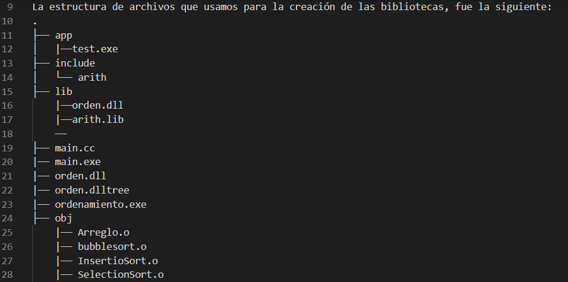

# Ordenamiento_Arreglos
Esta biblioteca tiene la función de ordenar números aleatorios con un tamaño definido por el usuario.
Se implementaron 3 métodos para la realización del ordenamiento.
Estos son: Bubble sort, Insertio sort y Selection sort.

La estructura de archivos que usamos para la creación de las bibliotecas, fue la siguiente:
.
├── app
│   |──test.exe
├── include
│   └── arith
├── lib
    |──orden.dll
    |──arith.lib
    ── 
├── main.cc
|── main.exe
|── orden.dll
|── orden.dlltree
|── ordenamiento.exe
├── obj
    |── Arreglo.o
    |── bubblesort.o
    |── InsertioSort.o
    |── SelectionSort.o
└── src 
    ├── Arreglo.cc
    ├── bubblesort.cc
    ├── SelectionSort.cc
    |── InsertioSort.cc 

Los comandos que utilizamos para la realización del proyecto fueron:

-New-Item (nombre de carpeta) -Type(Tipo) -Name (nombre) - Path (Dirección)

-git config -- user.email global "(correo)"(corre)"
-git config -- user.user global "(correo)"(nombre usuario)"
-git status 
-git clone
-git add "Nombredearchivo".cpp 
-git  commit -m"(Nombre)" // Este comando sirve para enviar el "archivo" al repositorio
-git pull
-git push
Biblioteca dinámica:
-g++ -shared .\src\Arreglo.cc -o orden.dll //Se comparte las funciones cc a un archivo dll
-g++ -shared .\src\bubblesort.cc -o orden.dll
-g++ -shared .\src\InsertioSort.cc -o orden.dll
-g++ -shared .\src\SelectionSort.cc -o orden.dll

-g++ main.cc orden.dll -o ordenamiento //Main toma las funciones de dll y se crea un ejecutable de ordenamiento
-g++ -c .\src\Arreglo.cc -o .\obj\Arreglo.o -I .\include //Se convierte en código fuente y se mueve a la carpeta obj
-g++ -c .\src\bubblesort.cc -o .\obj\bubblesort.o -I .\include// Este comando se utiliza para llamar la funcion bubblesort para convertirla en código fuente.
-g++ -shared .\src\bubblesort.cc -o orden.dll
-g++ -shared .\src\InsertioSort.cc -o orden.dll
-g++ -shared .\src\SelectionSort.cc -o orden.dll

-.\ordenamiento.exe  // Para ejecutar la biblioteca dinamica
-.\lib\dll\orden.dll // Se utiliza para acceder a la ruta de la biblioteca dinamica.

Manual para implementar una biblioteca de ordenamiento

Biblioteca estática:
    - Con el comando g++ -c <archivo> -o <archivo.o> -I <ruta> podemos convertir las funciones en código fuente y una vez implementada hace todas las funciones
     
    - Una vez implementado el comando anterior para todas las funciones de c++ se debe aplicar el siguiente comando:
     ar crs <archivo.lib> .\obj\*.o 
     Para crear tu biblioteca estática.

     - Para compilar la biblioteca se debe hacer uso del siguiente comando:
        g++ <archivo principal> -o <destino> -I <archivo> -L <ejecutable> -larith enlazando las bliblioteca

    - Y para ejecutar el programa se debe utilizar el siguiente comando:
    .\<nombre del ejecutable>.exe
     
Biblioteca dinámica:
    - Para tener una biblioteca .dll las funciones deben estar guardadas con el comando:
      g++ -shared <archivo> -o <nombre>.dll
    En donde se encarga de compartir las funciones en dll, debe aplicarse para todos los archivos con funciones.

    - g++ <archivo principal> <nombre del ejecutable>
    Este comando enlaza el main con la biblioteca dinamica en donde encuentra las funciones del archivo.

    - .\<nombre del ejecutable>.exe 
    Este comando ejecuta el archivo con la bilbioteca dinámica.
